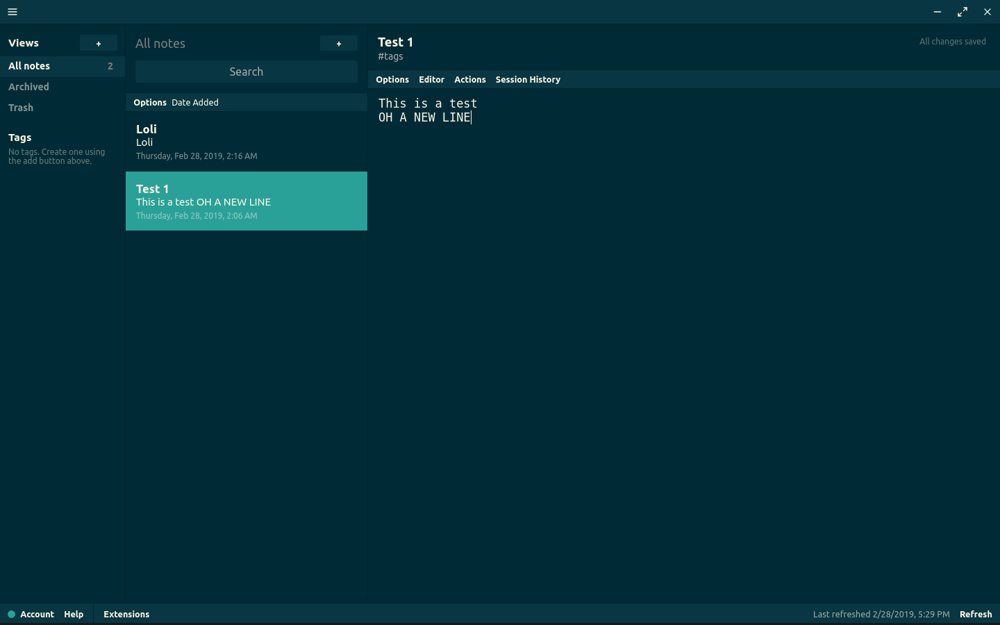

# Standard Notes themes

Repository for community contributed themes for [Standard Notes](https://standardnotes.org/).

## Installing
Third-party themes can be installed by clicking on "Extensions" > "Import Extension" in your StandardNotes webapp or desktop app, pasting the install link and pressing enter. Third-party themes do not require StandardNotes extended but are not compatible with the StandardNotes mobile app.

## Themes

### Better Solarized Dark

This theme was forked from [this repository](https://github.com/swalladge/sn-themes) in a quick attempt to package the *official solarized dark theme* as someone who has not yet bought the extended package.
Only the official .css file was used in place of the original theme's .css, and the links were updated to only take resources from this github page.
The .zip package necessary was created by the current .css and .json file, and includes these files only.
- Author: Orestarod
- License: GPLv3
- Sources: <https://github.com/orestarod/sn-themes>
- Install link: <https://raw.githubusercontent.com/orestarod/sn-themes/master/better-solarized-dark/package.json>



### Material Dark

This theme is similar to the Better Solarized Dark, but using a slightly different color theme and being based off the [Atom Material UI Theme](https://github.com/atom-material/atom-material-ui)

- Author: vantezzen
- License: MIT
- Sources: <https://github.com/vantezzen/sn-theme-material>
- Install link: <https://cdn.jsdelivr.net/gh/vantezzen/sn-theme-material/extension.json>


### Gruvbox Dark Theme

Theme based on the [gruvbox theme for vim](https://github.com/morhetz/gruvbox)

- Author: christianhans
- License: MIT
- Sources: <https://github.com/christianhans/sn-gruvbox-dark-theme>
- Install link: <https://listed.standardnotes.org/CkWVdPhzvs>


### s4skia Theme

Light theme that focus on readability on retina displays

- Author: flowinho
- License: GNU General Public License v3.0
- Sources: <https://github.com/flowinho/s4skia>
- Install link: <https://cdn.jsdelivr.net/gh/orestarod/sn-themes/theme-installers/s4skia.json>


### lyons Theme

Light, serif theme

- Author: jamesjlyons
- License: Not specified
- Sources: <https://github.com/jamesjlyons/Lyons>
- Install link: <https://cdn.jsdelivr.net/gh/orestarod/sn-themes/theme-installers/lyons.json>


### Mojave Dark Theme

Dark theme, which roughly matches Mojave Dark Mode.

- Author: matthew-cox
- License: Not specified
- Sources: <https://github.com/matthew-cox/sn-theme-mojave-dark-mode>
- Install link: <https://cdn.jsdelivr.net/gh/orestarod/sn-themes/theme-installers/mojave.json>


### Minimal

This theme is nearly the same as the default/blank theme, but widens the scroll bars. Helpful for people who want to do that, as well as anyone who wants to toy with customizing a barebones SN theme.

- Author: ajh3
- License: Not specified
- Sources: <https://github.com/ajh3/sn-theme-minimal>
- Install link: <https://cdn.jsdelivr.net/gh/orestarod/sn-themes/theme-installers/minimal.json>


### Solarized light

- Author: skulkingfox
- License: Not specified
- Sources: <https://github.com/skulkingfox/solarized-light-theme>
- Install link: <https://listed.standardnotes.org/lYxsNwG7Xi>


## Developing themes

The easiest way to develop a theme is to pick an existing theme that is
close to what you are wanting, and modify it from there. The desktop and web
applications use the css file, which afaik can contain any valid css, including
font imports and such. The mobile app uses the json style file. (todo: find
docs for what other json keys do)


To make a theme installable, follow the instructions at
<https://docs.standardnotes.org/extensions/publishing.html>.  There are some
gotchas. Most should be clear if you see the package.zip file I use for the
solarized theme. I use the package.json for both the extension metadata and the
package.json that is installed with the app and tells sn which file to load.

__TL;DR__

Theme files like this on an _https_ enabled web server:

```
/webroot/path/
             |- mytheme.json
             \- mytheme.zip
```

Distribute install url as `https://your.server/path/to/mytheme.json`.


# License

    Standard Notes themes
    Copyright (C) 2018 Samuel Walladge and contributors

    This program is free software: you can redistribute it and/or modify it
    under the terms of the GNU General Public License as published by the Free
    Software Foundation, either version 3 of the License, or (at your option)
    any later version.

    This program is distributed in the hope that it will be useful, but
    WITHOUT ANY WARRANTY; without even the implied warranty of MERCHANTABILITY
    or FITNESS FOR A PARTICULAR PURPOSE.  See the GNU General Public License
    for more details.

    You should have received a copy of the GNU General Public License along
    with this program.  If not, see <http://www.gnu.org/licenses/>.
